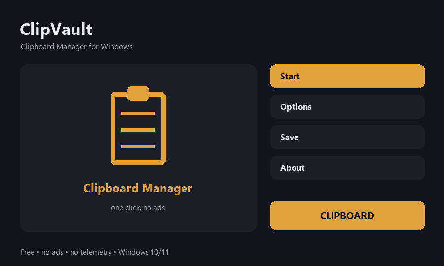

# ClipVault — Clipboard Manager for Windows

Free clipboard manager for Windows - history of everything you copy

**[⬇ Download for Windows](../../releases/latest)** — free, no ads, no account, no sign-up. One small file, unzip and run.

## What it does

- Keeps a running history of copied text
- Click any item to copy it back to the clipboard
- Clear the history whenever you want
- Light and fast, sits quietly in a window
- Nothing leaves your PC - history stays local
- Free and open source, no ads and no telemetry

## How to use

1. Open ClipVault and leave it running.
2. Copy text as usual - every copy is kept in the list.
3. Double-click any item, or select it and press Copy back, to put it in the clipboard again.
4. Press Clear when you want the history gone.

## Requirements

Windows 10 or 11, 64-bit. No admin rights needed and nothing is written to the registry. It runs fine on weak, old and budget machines.

## Privacy

Everything happens on your PC. Nothing is uploaded, there is no telemetry, no ads and no account.

## Licence

MIT — free to use, free to share.
