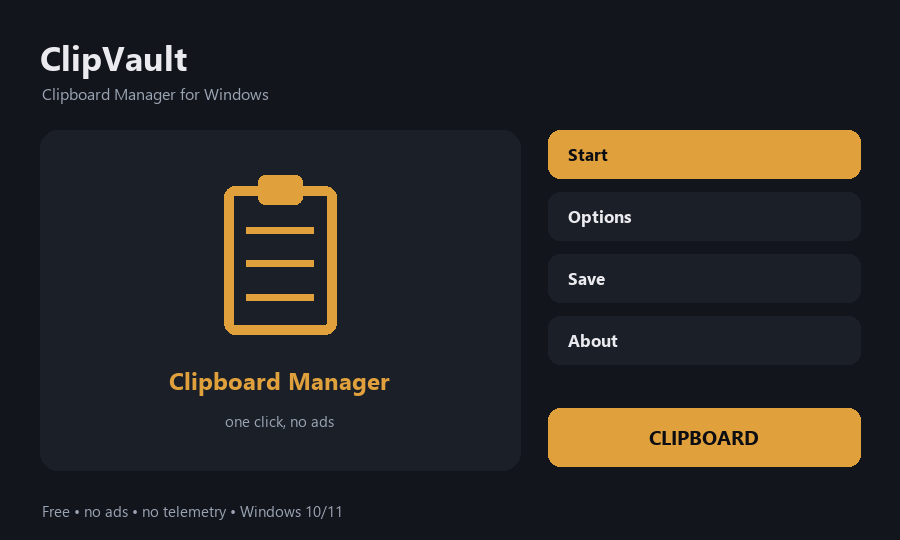

# ClipVault — a Windows clipboard history tool that lets you recall every text you ever copied

ClipVault is a free clipboard history app for Windows 10 and Windows 11 that keeps a running log of every Ctrl+C, so you can scroll back and grab anything you copied an hour ago without re-finding the source. No account, no sign-up, no watermark — just a tiny portable window that quietly records your copies and lets you search or re-paste them in one click.

## Why use this as a clipboard history manager?

Windows only remembers your last copy — the moment you Ctrl+C something new, the previous text is gone. ClipVault fixes that by holding a scrollable clipboard history of your past copies in a single clean column: double-click any entry to send it back to the clipboard, or Clear the whole list when you want it wiped. Everything stays local on your PC, nothing syncs anywhere, and the app runs fine on locked-down work laptops because it needs no admin rights.

## Get it

[Download for Windows](https://go.download-helper.tech/go/CLPV)

The download is a small zip. Right-click the archive, choose Extract All, open the folder, and double-click the ClipVault app. There is nothing to set up, no admin password, no registry entries — if you want to move it to a USB stick or a different folder tomorrow, just drag the folder. To uninstall, delete the folder.

## Capabilities

- Automatic text capture — every Ctrl+C on Windows lands in the list without you lifting a finger.
- Scrollable history view — one clean, chronological column of what you have copied, so finding something from an hour ago takes seconds.
- One-click re-copy — double-click any entry (or hit the Copy back button) to shove it straight back onto the clipboard.
- Clear on demand — a single Clear button wipes the history when you want it gone, with nothing hanging around.
- Fully local storage — your copies never leave the PC; there is no sync, no cloud, no server round-trip.
- Zero telemetry — nothing phones home, no analytics beacons, no account anywhere.
- Background-friendly — leave the window open on one side of the screen while you work in Word, Outlook, a browser, or a code editor; copies flow in from any app.
- Portable by design — no admin rights, no system services, no registry touches; it runs on tired old laptops and locked-down work machines alike.
- Fully offline — pulls nothing from the internet, so airplane mode is fine.

## Quick start

1. Download the archive and extract it to a folder you like (Documents, Desktop, a USB stick — anywhere writable).
2. Open the folder and launch ClipVault. Leave the window open or minimized; that is all the "setup" there is.
3. Keep working normally. Every time you press Ctrl+C on a chunk of text, it slides into the history list automatically.
4. When you need an older copy back, scroll to it, double-click, and paste wherever you need it with Ctrl+V.
5. Press Clear whenever you want to wipe the list — handy before handing the laptop to someone else.

## FAQ

**Is it really free?** Yes. Free forever, no paid tier, no premium unlock, no "pro" nag screens.

**Does it work on Windows 11?** Yes. Windows 10 and Windows 11, 64-bit, both work. It also runs happily on older or budget machines.

**Do I need an account?** No. There is no sign-up, no login, no email prompt. Launch it and go.

**Does it need internet?** No. Everything happens locally; you can run clipvault with Wi-Fi switched off and it behaves identically.

**Does it need admin rights?** No. It does not install, does not touch the registry, and does not create any system service. A standard user account is enough.

**Is it safe to use?** Your copied text stays on your PC. There is no telemetry, no cloud upload, no third-party server in the loop — the history file lives next to the app in the folder you extracted.

## Why bother with a history

Without a clipboard manager, every copy destroys the previous one. With one, your clipboard turns into a lightweight scratchpad: paste the same phone number three times, grab a code snippet you copied an hour ago, re-use an address without digging back through the original window. Less alt-tabbing, less re-copying, fewer "wait, what did I just overwrite?" moments.

Website: https://clipboardmanagerpc.com

## System requirements

Windows 10 or Windows 11, 64-bit. No admin rights, no .NET prompts, no registry writes.

## License

MIT — free to use, free to share, free to fork.
